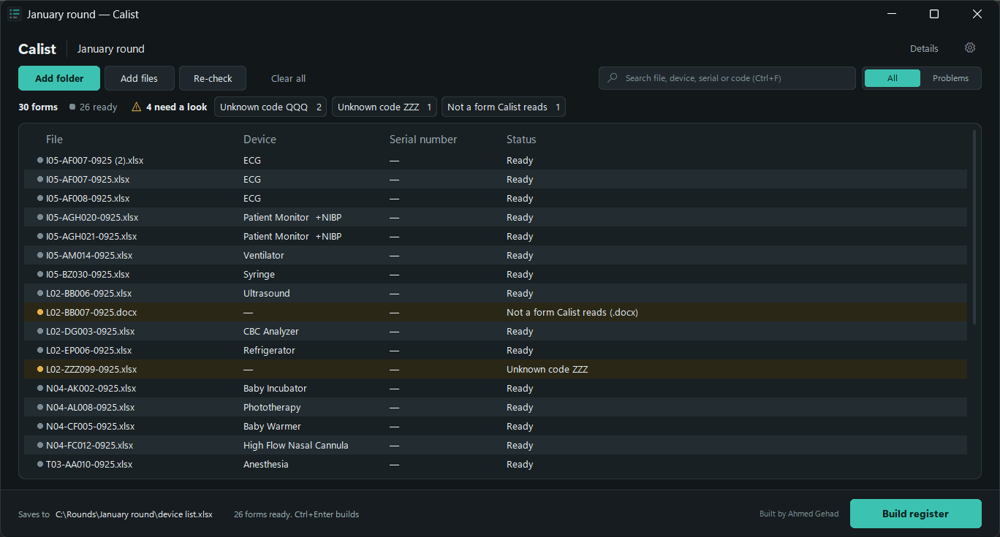
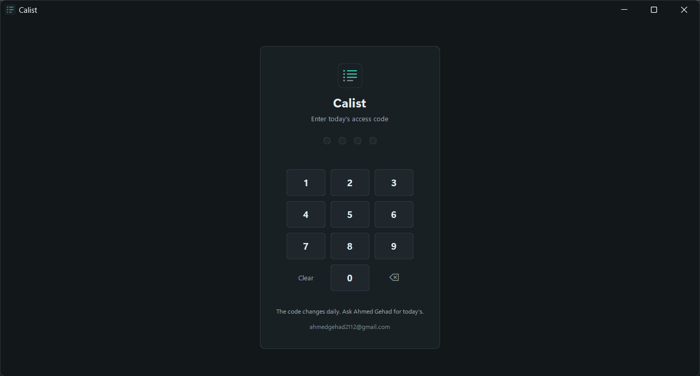
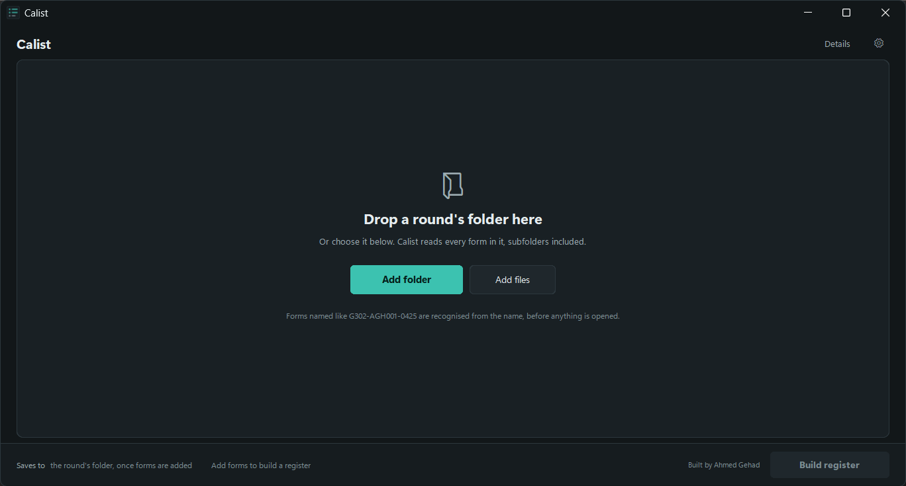
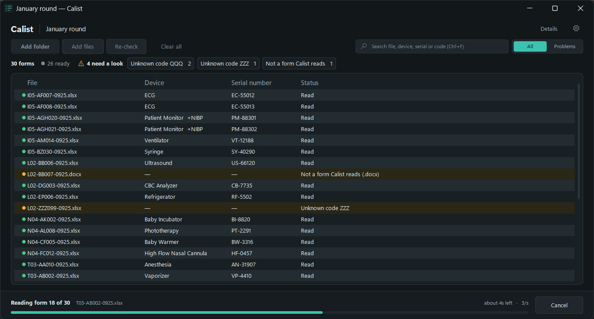
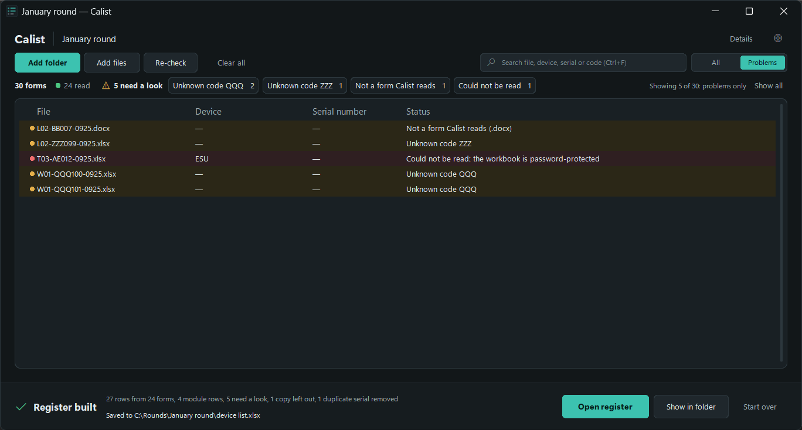
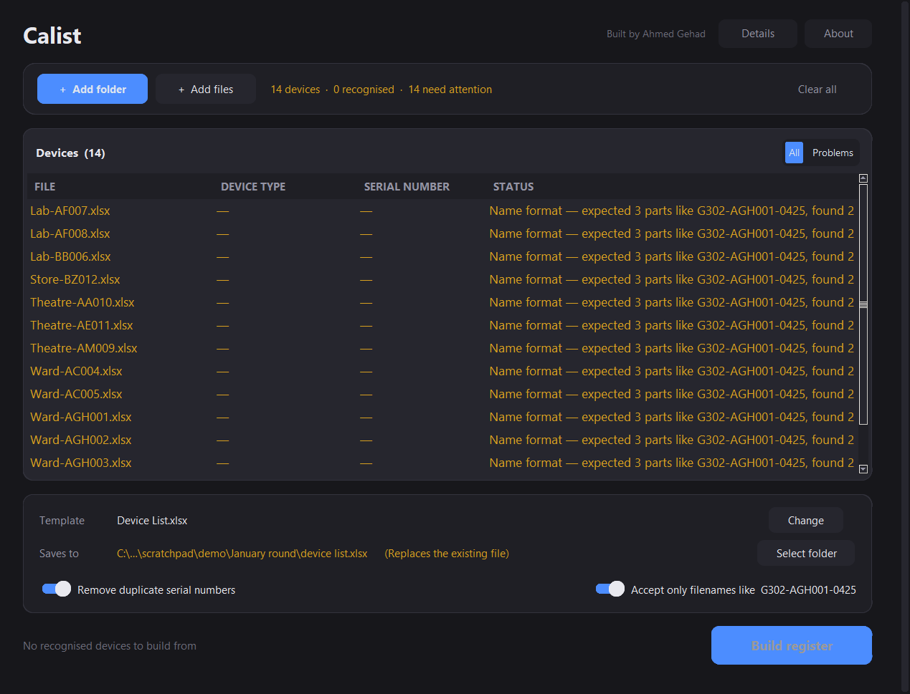

<div align="center">


# Calist

### An afternoon of Excel, done in six seconds.

**Calist turns a folder of medical-device inspection forms into one clean, sorted,
de-duplicated equipment register — automatically, without opening a single file by hand.**

<br>

[](https://github.com/AhmedGehad1/Calist/releases/latest/download/Calist.exe)

<br>

[](https://github.com/AhmedGehad1/Calist/actions/workflows/tests.yml)
[](https://github.com/AhmedGehad1/Calist/actions/workflows/release.yml)


<br>



</div>

---

## The problem it solves

Biomedical equipment inspections are recorded **one Excel form per device**. A single hospital wing
produces several hundred in a round, and every form holds the same six facts: manufacturer, model,
serial number, location, date, status.

The trap is that **those six cells sit somewhere different on every device's form.**

| Device | Where the serial number lives |
|---|---|
| Defibrillator | `K15` |
| ECG | `J32` |
| Ultrasound | `L17` |
| Sphygmomanometer | `K47` |
| Baby Incubator | `L72` |

Fifty-seven device types. Fifty-seven layouts. Building the register by hand means opening every
file, working out which layout you are looking at, finding six scattered cells, and copying them
across — several hundred times, without a single transcription error.

**Calist already knows all fifty-seven.** Point it at the folder and walk away.

<div align="center">

| Doing it by hand | With Calist |
|:---|:---|
| Open 300 files, one at a time | Pick the folder once |
| Remember 57 different cell layouts | Recognised automatically from the filename |
| Find the one bad file at row 214 | Flagged **before** the run even starts |
| Retype serial numbers and hope | Read straight from the cell, never retyped |
| Sort and number the rows yourself | Sorted, numbered and de-duplicated for you |
| **An afternoon** | **~6 seconds** |

</div>

---

## Contents

**[Download](#download)** · [Access code](#access-code) · [Features](#what-makes-it-good) ·
[How it works](#how-it-works) · [Performance](#performance-measured-not-estimated) ·
[Filename convention](#filename-convention) · [The device engine](#the-device-engine) ·
[Two-row devices](#two-row-devices) · [Duplicate serials](#duplicate-serial-numbers) ·
[Engineering](#engineering) · [Headless use](#headless-use) · [Development](#development) ·
[Known issues](#known-issues) · [Author](#author)

---

## Download

<div align="center">

### [⬇ &nbsp; Download Calist.exe](https://github.com/AhmedGehad1/Calist/releases/latest/download/Calist.exe)

**One file. No installer. No Python. Nothing to configure.**

</div>

Download it, double-click it, point it at your folder. The register template is built into the
executable, so the very first launch works with zero setup.

| | |
|---|---|
| **Size** | 12.7 MB as a single `.exe`, or 13.0 MB zipped |
| **Requirements** | Windows 10 or 11. Nothing else — no runtime, no dependencies, no admin rights |
| **Provenance** | Every release is built, tested and published automatically by [GitHub Actions](https://github.com/AhmedGehad1/Calist/actions/workflows/release.yml) straight from the source in this repository |
| **Verify it** | [`SHA256SUMS.txt`](https://github.com/AhmedGehad1/Calist/releases/latest) ships with every release — `Get-FileHash .\Calist.exe -Algorithm SHA256` |
| **History** | [All releases](https://github.com/AhmedGehad1/Calist/releases) |

> **On first launch** Windows shows *"Windows protected your PC"*, because the file is not
> code-signed — a certificate costs several hundred dollars a year, and this is a free tool.
> Click **More info → Run anyway**. You will only ever see it once.

### If Windows or your antivirus blocks it

There is a second download — **[Calist-windows.zip](https://github.com/AhmedGehad1/Calist/releases/latest/download/Calist-windows.zip)**
— that exists for exactly this. Unzip it anywhere and run the `Calist.exe` inside. It is the same
application; it is packaged differently, and the difference is the whole point.

<details>
<summary><b>Why it happens, and why the ZIP gets through</b></summary>

<br>

Some scanners report the single-file download as something like
`Trojan:Win32/Sabsik.FL.A!ml`. The `!ml` suffix is the important part: it marks a **machine-learning
guess**, not a match against any known malware. It is a false positive, and a common one for Python
applications packaged this way. Three properties of the build drive it:

| | |
|---|---|
| **It unpacked itself at launch** | A one-file build extracts its payload into `%TEMP%\_MEIxxxx` and runs from there. Self-extract-then-execute is textbook packed-malware behaviour and is the single heaviest signal. **The ZIP is a plain folder build that never does this.** |
| **It carried no version resource** | Releases before v1.2.0 shipped with no company, product or description recorded in the file at all. Legitimate software fills these in; packed malware usually does not. **Fixed in v1.2.0** — right-click → Properties → Details now shows the publisher, product and version. |
| **It is unsigned** | An unsigned binary downloaded a handful of times has no reputation to weigh against the heuristic. This one is honest: **only a code-signing certificate fixes it**, and Calist does not have one. |

What you can do about it:

- **Use the ZIP.** It removes the biggest of the three signals.
- **Check the hash** against `SHA256SUMS.txt` on the release page, so you know your copy is the one
  GitHub built.
- **Read the build log.** Every release is built by GitHub Actions from the tagged public source in
  this repository — the entire process is on the [Actions tab](https://github.com/AhmedGehad1/Calist/actions/workflows/release.yml).
- **Report the false positive.** Microsoft clears these through
  [their submission form](https://www.microsoft.com/en-us/wdsi/filesubmission), usually within a few
  days, and the correction reaches every Defender installation.
- **For a managed workplace machine**, your IT department can allowlist the file by its SHA-256 hash.
  Everything above is what they will ask for.

</details>

<details>
<summary><b>Prefer to run from source?</b></summary>

<br>

```bash
git clone https://github.com/AhmedGehad1/Calist.git
cd Calist
pip install -r requirements.txt
python calist.py
```

Python 3.10 or newer. `openpyxl`, `xlrd` and `customtkinter` install from `requirements.txt`.

Installing `tkinterdnd2` as well enables dragging a folder straight onto the window. Without it the
drop zone is click-only and nothing else changes.

</details>

<details>
<summary><b>Prefer to build the executable yourself?</b></summary>

<br>

```bash
pip install pyinstaller

pyinstaller calist.spec --noconfirm --clean               # -> dist/Calist.exe
CALIST_ONEDIR=1 pyinstaller calist.spec --noconfirm       # -> dist/Calist/
```

[`calist.spec`](calist.spec) is the build recipe, and four settings inside it are load-bearing (all
commented in place):

- `hiddenimports=["ui", "access"]` — the interface is imported lazily so the pipeline stays
  GUI-free, which means PyInstaller's static analysis cannot see it.
- `collect_data_files("customtkinter")` — CustomTkinter loads its themes and fonts from disk at
  runtime, and a build without them fails to draw.
- `upx=False` — UPX-packing an unsigned executable is one of the strongest signals antivirus
  heuristics look for. It saves a few megabytes and costs the download its reputation.
- `version=` — the generated Windows version resource. Its absence was part of why earlier releases
  were flagged, so CI fails the build if it comes out empty.

The version number comes from `__version__` in [`calist.py`](calist.py); `CALIST_VERSION` overrides
it, and the release workflow refuses to build a tag that disagrees with it.

</details>

---

## Access code

Calist asks for a **four-digit code** the first time it is opened each day. The code changes daily,
is generated offline with no server and no licence file, and once entered the app stays unlocked for
the rest of that calendar day. Crossing midnight asks again.

<div align="center">
  
</div>

<div align="center">

**Ask Ahmed Gehad — [ahmedgehad2112@gmail.com](mailto:ahmedgehad2112@gmail.com) — for today's code.**

</div>

Wrong entries are rate-limited: five attempts, then a cooldown starting at 30 seconds and doubling,
capped at 15 minutes. The cooldown is stored, so closing the window does not clear it, and a correct
code entered during a cooldown is still refused.

---

## What makes it good

<table>
<tr><td width="34%"><b>Folder-first, not file-first</b></td>
<td>Pick <i>one folder</i> and every Excel file inside it is pulled in — subfolders included. No hand-picking three hundred files, no multi-select gymnastics.</td></tr>

<tr><td><b>Problems surface <i>before</i> the run</b></td>
<td>Every file is resolved to a real device the instant it is added, in about 14 microseconds each. An unrecognised device code appears in the table <b>immediately</b> — not two hundred files into a long run.</td></tr>

<tr><td><b>You can watch it work</b></td>
<td>Rows turn green one by one as each device is read, with a progress bar, the file currently open, and a live estimate of the time remaining. It never looks frozen, because it never is.</td></tr>

<tr><td><b>Cancel at any moment</b></td>
<td>Stops cleanly between files and writes absolutely nothing. A cancelled run leaves no half-finished register behind.</td></tr>

<tr><td><b>You choose where it saves</b></td>
<td>The <i>Saves to</i> row shows exactly where the register will land <b>before</b> you commit, and warns you in amber if a register is already sitting there. <b>Select folder</b> puts it anywhere you like; leave it alone and it lands beside your forms.</td></tr>

<tr><td><b>Understands two-row devices</b></td>
<td>A patient monitor and its NIBP module share one chassis and one serial, but need two lines in the register. Calist generates the second row itself and sorts it directly beneath its parent.</td></tr>

<tr><td><b>Duplicate removal that knows better</b></td>
<td>Optional, and smart: it drops repeated serials, but understands that a device and its own sub-module legitimately share one. A <i>third</i> record on that serial is still removed.</td></tr>

<tr><td><b>Optional filename discipline</b></td>
<td>One switch enforces the <code>G302-AGH001-0425</code> house format, and tells you <i>exactly</i> what is wrong with each offender — wrong month, missing site code, wrong number of parts.</td></tr>

<tr><td><b>Daily access code</b></td>
<td>Offline, server-free, changes every day. No licence files, no activation, no internet connection.</td></tr>

<tr><td><b>Every register is signed</b></td>
<td>Author name and contact are written into a footer line <i>and</i> the workbook's Excel document properties, so credit travels with the file wherever it is emailed or filed.</td></tr>

<tr><td><b>Nothing to set up</b></td>
<td>The register template ships inside the executable. A freshly downloaded copy is usable on the first launch, and you can swap in your own template whenever you like.</td></tr>

<tr><td><b>Remembers your setup</b></td>
<td>Template, last folder and every preference persist between sessions, so a repeat run is two clicks.</td></tr>

<tr><td><b>Old and new Excel alike</b></td>
<td><code>.xlsx</code> and <code>.xlsm</code> through a reader written for exactly this job, legacy <code>.xls</code> through xlrd. One code path, both formats.</td></tr>

<tr><td><b>Fully scriptable</b></td>
<td>The pipeline imports no GUI toolkit whatsoever, so the whole thing drives from plain Python for batch jobs and automation.</td></tr>
</table>

---

## How it works

<table>
<tr>
<td width="50%"></td>
<td width="50%"></td>
</tr>
<tr valign="top">
<td>

### 1 · Add your devices

Pick a folder and every Excel file inside it comes in, subfolders and all.

Each one is checked the moment it arrives, so an unrecognised device shows up in the table straight
away — before you commit to anything.

</td>
<td>

### 2 · Watch it work

Rows turn green as each device is read, with the file currently open and a live estimate of the time
left.

Cancel stops it cleanly, and writes nothing at all.

</td>
</tr>
</table>

<div align="center">

</div>

### 3 · Collect the register

The results card says precisely what was built and exactly where it went, with **Open register** and
**Reveal in folder** one click away. The table filters itself down to anything that needs your
attention, so five problem files out of three hundred are never buried.

The register is saved as `device list.xlsx`. By default it lands beside the first source file; use
**Select folder** on the *Saves to* row to send it anywhere else. Either way the exact destination is
on screen the entire time, so it is never a mystery afterwards.

<details>
<summary><b>What actually happens to a single form</b></summary>

<br>

```
G302-AGH001-0425.xlsx
        │
        ├─ 1. read the device code from the filename ──►  "AGH"
        │
        ├─ 2. look it up in the device table ──────────►  Model E18, S.N K18, Status D39, …
        │
        ├─ 3. read exactly those cells from sheet 1 ───►  {Model: "MX450", S.N: "SN-100", …}
        │
        ├─ 4. generate the sub-module row, if any ─────►  + a second "NIBP" row
        │
        ├─ 5. sort by device code, modules beneath ────►  parent, then its module
        │
        ├─ 6. drop duplicate serials, if enabled ──────►  keeping legitimate pairs
        │
        └─ 7. write into a copy of your template ──────►  device list.xlsx, signed
```

</details>

### Keyboard

| Shortcut | Action |
|---|---|
| <kbd>Ctrl</kbd> + <kbd>O</kbd> | Add a folder |
| <kbd>Ctrl</kbd> + <kbd>Enter</kbd> | Build the register |
| <kbd>Esc</kbd> | Cancel a running build |
| <kbd>Delete</kbd> | Remove the selected rows |
| Double-click | Reveal that file in Explorer |

---

## Performance, measured not estimated

Benchmarked on real forms spanning the full range of device layouts, on an ordinary desktop machine,
and repeated to confirm the figures were not a fluke:

<div align="center">

| Operation | Result |
|:---|:---|
| Reading one inspection form | **≈ 2 ms** (median; ~380 ms before) |
| Full run — 20,000 forms into 38,804 register rows | **≈ 39 seconds** (~700 forms/second) |
| Scanning a folder of 20,000 forms | **under 1 second**, window stays live |
| Pre-flight validation of 300 filenames | **under 5 ms** (~14 µs each) |
| Filename format check, per name | **≈ 0.7 µs** (1.5 million/second) |
| Cold start of the packaged executable | **≈ 3–4 seconds** |

</div>

Pre-flight is that cheap because it **never opens a workbook** — it resolves the filename against the
device table and stops there. That is exactly what makes validate-on-add practical for a folder of
several hundred forms, and why an unrecognised device is caught the instant you drop the folder in
rather than after a five-second run.

The format check is a single precompiled regular expression on the accepting path. The detailed
per-part diagnosis — *"month '13' in '1325' is not between 01 and 12"* — only ever runs for a name
that has **already** failed, so a correctly named folder never pays a penny for it.

---

## Filename convention

The device type is read from the filename, so this part matters:

```
G302-AGH001-0425.xlsx
     └─┬──┘
       └──  everything after the first "-", leading letters only  →  AGH
```

If there is no `-`, the whole name is used (`VNT023.xlsx` → `VNT`). A file whose code is not in the
device table is **skipped with a clear error** rather than silently producing a junk row — a missing
row is recoverable, a wrong one might never be noticed.

### Enforcing the house format

By default any filename is accepted so long as a device code can be read from it. Flip on
**Accept only filenames like G302-AGH001-0425** and the full house format becomes mandatory:

```
G302  -  AGH001  -  0425
 │         │          └── MMYY — month 01-12, then a two-digit year (0425 = April 2025)
 │         └───────────── device code and unit number (AGH001 = patient monitor 1)
 └───────────────────────  site code — letters, then digits
```

Anything that breaks it is flagged **before you build**, with the specific reason rather than a
useless blanket "invalid":

| Filename | Reported as |
|---|---|
| `Clinic-AGH005` | expected 3 parts like G302-AGH001-0425, found 2 |
| `302-AC006-0425` | site code '302' should be letters then digits, like G302 |
| `G302-AGH-0425` | device code 'AGH' should be letters then digits, like AGH001 |
| `G302-AGH007-425` | date '425' should be 4 digits (MMYY), like 0425 |
| `G302-AGH004-1325` | month '13' in '1325' is not between 01 and 12 |

<div align="center">
  
</div>

---

## The device engine

All 57 layouts live in [`device_config.py`](device_config.py). Because 51 of the 57 forms turn out to
be *the same layout at a different row offset*, they are generated rather than typed out:

```python
"DG": {"device_name": "CBC Analyzer", "cells": form(18, "H32")},
```

`form(row, status)` takes the row holding the **Model** and derives everything else from it:

```
                      form(18, "H32")

      Date          E16   ← row − 2
      Model         E18   ← row            the anchor
      Manufacturer  E20   ← row + 2
      S.N           K18   ← row,     value column
      Location      K20   ← row + 2, value column
      Status        H32   ← given explicitly; it moves the most
```

Keyword arguments absorb every variation:

| Argument | Use when | Example |
|---|---|---|
| `col=` / `val=` | the form uses a different column pair | `form(32, "F41", col="D", val="J")` |
| `date_gap=4` | an extra line sits above the Date | `form(26, "G35", date_gap=4)` |
| `extra={...}` | a second serial, a second status, or a one-off cell | `form(17, "H30", extra={"S.N2": "L21"})` |

The result: **55 of the 57 devices are a single readable line each**, and only two genuinely
different forms (`AK` Baby Incubator, `CF` Baby Warmer) are written out in full. That asymmetry is
deliberate — the odd ones out are supposed to stand out, not hide inside a wall of near-identical
blocks.

### Adding a new device takes one line

Find the Model cell on the form, note the Status cell, and add:

```python
"XY": {"device_name": "Your Device", "cells": form(<model row>, "<status cell>")},
```

No code changes. No special cases. Sorting, second rows and de-duplication all follow automatically.

<details>
<summary><b>All 57 supported devices</b></summary>

<br>

| | | |
|---|---|---|
| `AA` Anesthesia | `AV` Elisa reader | `EC` Laminar flow |
| `AB` Vaporizer | `AX` Lab Incubator | `ED` Heart lung Machine |
| `AC` Defibrillator | `BB` Ultrasound | `EE` Flowmeter |
| `AD` Pacemaker | `BF` X-ray | `EO` Pipet |
| `AE` ESU | `BL` Autoclave | `EP` Refrigerator |
| `AF` ECG | `BP` Balance | `EU` Lab Oven |
| `AGH` Patient Monitor | `BV` Blood gas analyzer | `EV` Blood Mixer |
| `AH` SPO2 | `BZ` Syringe | `EY` Freezer |
| `AI` Infusion | `CA` X-ray () | `FE` Nebulizer |
| `AJ` Suction | `CB` Digital blood pressure | `FG` ACT |
| `AK` Baby Incubator | `CE` Sphygmomanometer | `FI` Hormone Analyzer |
| `AL` Phototherapy | `CF` Baby Warmer | `FJ` OR Table |
| `AM` Ventilator | `CK` Infrared | `FQ` C-pap |
| `AN` Thermo | `DA` Shaker | `GC` Portable Data Logger |
| `AO` Infrared | `DG` CBC Analyzer | `GD` Protien Analyzer |
| `AQ` Water Bath | `DL` Sealing Machine | `GI` Bacteria Analyzer |
| `AR` Electrolyte Analyzer | `DO` O2 conc | `GK` Tornique |
| `AS` Centrifuge | `DV` OR light | `GP` Holter machines |
| `AU` Chemistry analyzer | `EA` C-Arm | `VAH` Vital Sign (SPO2 Module) |

<sub>Names appear exactly as they are written into the register, including the spelling slips noted
under <a href="#known-issues">Known issues</a>.</sub>

</details>

---

## Two-row devices

Some units are inspected as one device but must be recorded as two. A patient monitor and its NIBP
module share a chassis and a serial number, yet each needs its own status and its own line.

A `second_row` block generates that line automatically:

```python
"AGH": {
    "device_name": "Patient Monitor",
    "cells": form(18, "D39", extra={"Status2": "J39"}),
    "second_row": {"device_name": "NIBP", "code_replace": ("AGH", "AGCB")},
},
```

The generated row copies the parent's data, takes its status from the `Status2` cell, and rewrites
the device code — `G302-AGH001-0425` becomes `G302-AGCB001-0425`, replacing the device token only
and leaving the site code and date untouched. It always sorts directly beneath its parent, never
adrift somewhere else in the register.

---

## Duplicate serial numbers

With **Remove duplicate serial numbers** switched on, a repeated serial is dropped and logged **by
filename** — the two forms involved are named, because those are the files you have to open:

```
Duplicate serial 'SHARED-SN-42' — skipped D23-AF007-0225.xlsx, already recorded by D23-AF001-0225.xlsx
```

The device type is deliberately not what gets reported: a round holding a dozen of the same model
makes it useless for finding the form.

The exception is a device and its own generated sub-module: they legitimately share one serial,
because they are one physical unit. A *third* record carrying that serial is still dropped.

Blank serials are always kept — several devices with no serial recorded must not collapse into a
single row.

---

## Engineering

Calist is a small application built to be maintained, not merely to work today.

| | |
|---|---|
| **Strict layering** | Four modules, one direction. `ui.py` → `calist.py` → `device_config.py`, with `access.py` standing entirely alone. The pipeline imports no GUI toolkit at all, so `import calist` costs nothing and pulls in nothing. |
| **Two reporting channels, deliberately** | The pipeline emits log records *and* returns structured `FileOutcome` / `RunResult` values. The log drives the details drawer; the structures drive the table. Neither replaces the other. |
| **Thread-safe by construction** | Extraction runs on a worker thread. It never touches a widget and never reads a Tk variable — everything crosses back through queues drained on the main thread, which also batches redraws so three hundred files do not repaint the table three hundred times. |
| **Output stability is verified, not assumed** | Every refactor is checked by building the same register before and after and diffing the workbooks cell by cell. The register output has been proven byte-identical across two major rewrites. |
| **Fails closed, never open** | A missing or unreadable settings file locks the app rather than opening it. An unknown device code skips the file rather than inventing a row. A cancelled run writes nothing. |
| **Automated release pipeline** | Tag a version and GitHub Actions runs the full suite, builds both download shapes, refuses to continue if the tag and the version in the source disagree, checks the executable's size and version resource to catch a build missing its bundled data or its identity, publishes SHA-256 checksums, and releases. A build that fails its tests never reaches the download link. |

---

## Headless use

The pipeline knows nothing about the interface, so the whole thing drives from Python:

```python
from calist import process_files

result = process_files(
    ["G302-AGH001-0425.xlsx", "G302-AC003-0425.xlsx"],
    "Device List.xlsx",
    deduplicate=True,
    strict_names=True,
)

print(result.rows_written, "rows ->", result.output_path)
for problem in result.problems:
    print(f"skipped {problem.filename}: {problem.detail}")
```

`process_files` also accepts `on_file=` for per-file progress and `cancel=` (a `threading.Event`) to
stop a long run — a cancelled run writes nothing at all.

To ask what a filename *would* resolve to, without opening it:

```python
from calist import classify_file, check_filename_format

classify_file("G302-AGH001-0425.xlsx").device_name   # 'Patient Monitor  +NIBP'
classify_file("G302-ZZZ999-0425.xlsx").status        # 'unknown_code'

check_filename_format("G302-AGH001-0425")            # None - it is fine
check_filename_format("G302-AGH001-1325")            # "month '13' ... is not between 01 and 12"
```

---

## Development

```bash
pip install -r requirements.txt
pip install pytest
python -m pytest
```

**135 tests**, run in CI against Python 3.10, 3.11 and 3.12 on every push:

| Suite | Covers |
|---|---|
| [`test_calist.py`](test_calist.py) — 72 tests | Filename parsing and format validation, value handling, sheet selection, merged-cell resolution, ordering, de-duplication (including that the warning names the two files involved), second-row generation, pre-flight classification, cancellation, attribution, plus end-to-end runs against workbooks built on the fly |
| [`test_access.py`](test_access.py) — 35 tests | The daily code: known-date vectors, zero-padding, rejection of malformed input, midnight relocking, and cooldown escalation |
| [`test_settings.py`](test_settings.py) — 7 tests | Preference persistence, including BOM-tolerant reading, corrupt files, and unwritable profiles |

Several tests exist purely to stop a future change quietly weakening something:

- One asserts every two-row device's names are covered by the shared-serial exemption, so **renaming
  a device cannot silently break de-duplication**.
- One asserts pre-flight works on a path that does not exist, so it **cannot start touching the
  disk**.
- One asserts a missing settings file reads as *locked*, so the access code **cannot fail open**.

The suite imports `calist` and `access` only — never `ui` — so it needs no display and no GUI
toolkit.

### Project layout

```
calist.py                    the extraction pipeline - imports no GUI toolkit    (664 lines)
ui.py                        the desktop interface, CustomTkinter               (1399 lines)
access.py                    the daily access code - pure, standalone            (138 lines)
device_config.py             57 device layouts and the form() helper             (180 lines)
calist.spec                  PyInstaller build recipe
template/Device List.xlsx    reference register template
```

---

## Known issues

Stated openly. Four entries in the device table need checking against the paper forms:

- **`EU`** (Lab Oven) puts Location at `K19`; every other standard form puts it at `K20`.
- **`CF`** (Baby Warmer) has Model *below* Manufacturer — inverted compared with all 56 others.
- **`CA`** is identical to `BF`, and its name is unfinished in the source (`"X-ray ()"`).
- **`AO`** and **`CK`** are both named `Infrared` with different Status cells.

**A field reading blank almost always means the form was re-laid-out** and its cell map now points
somewhere else. There is a command for exactly that, and it opens no window:

```powershell
python calist.py --inspect "G302-BB001-0526.xlsx"
```

It prints every mapped field, the cell it reads, what came back, and the sheet's merged ranges,
exiting non-zero if anything read blank — which tells you whether to change the form or the map.

Three device names carry spelling slips that reach the register output — `Protien Analyzer`,
`Tornique` and `X-ray ()`. They are left alone deliberately: correcting them changes the text written
into every historical register, so it should be a considered decision rather than a drive-by fix.

Because the output lands among the source files, selecting the same folder twice would feed the
previous run's output back in. Its code resolves to `DEVICE`, which is not in the table, so it is
skipped with an error rather than corrupting the register.

---

## Author

<div align="center">

### Ahmed Gehad

[](mailto:ahmedgehad2112@gmail.com)

</div>

Every register Calist produces is signed with this attribution — in a footer line beneath the data,
and in the workbook's Excel document properties — so the credit travels with the file.

## License

No licence is granted. The source is published for reference; all rights are reserved by the author.
If you would like to use it, please get in touch.
