<div align="center">


# Calist

**A folder of inspection forms in. One clean equipment register out.**

Calist reads every medical-device inspection form in a round, finds the six facts each one holds,
and writes them into a single sorted register. It doesn't retype anything, and it doesn't make you
open three hundred files to do it.

<br>

[](https://github.com/AhmedGehad1/Calist/releases/latest/download/Calist.exe)
&nbsp;
[](https://github.com/AhmedGehad1/Calist/releases/latest/download/Calist-windows.zip)

[](https://github.com/AhmedGehad1/Calist/actions/workflows/tests.yml)
[](https://github.com/AhmedGehad1/Calist/actions/workflows/release.yml)


<br>

<picture>
  <source media="(prefers-color-scheme: dark)" srcset="docs/readme/screen-round-dark.png">
  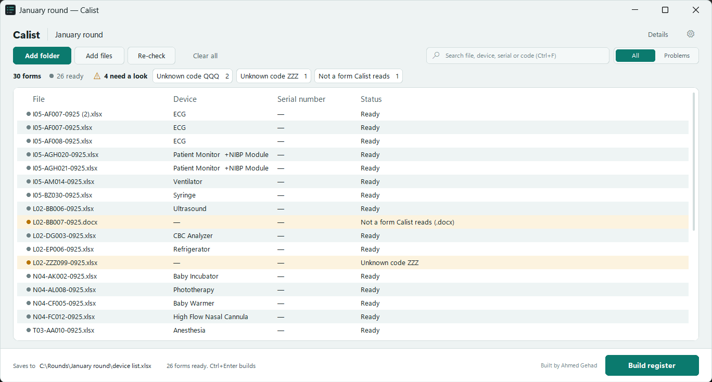
</picture>

</div>

<br>

## What's new in 2.0.2

- **Tidier device names.** `Protein Analyzer` and `Tourniquet` are finally spelt right. Every name
  is in Title Case. `SPO2` is now `Pulse Oximeter`, `Holter machines` is `Holter Machine`, and
  `Thermometer, patient` reads `Patient Thermometer`. The patient monitor's second row is now
  `NIBP Module`.
- **Thermometers say what kind they are.** Forms filed under `AN` are named from their own
  *Device Type* box. "Infrared" becomes `Infrared Thermometer`, "Digital thermometer" becomes
  `Digital Thermometer`, and a certificate that says *Portable Data Logger* is taken at its word.
  A form that only says "Thermometer", or has no box at all, is an infrared one.
- **Amber notes that say what actually happened.** When an engineer leaves the serial box empty
  and Calist finds the serial on the Cover Report instead, the note now says exactly that. The old
  note blamed the device table, which was right all along.

Every change was checked against the whole four-year archive before it went in: same values, same
amber cells, only the wording different. The full list is on the
[releases page](https://github.com/AhmedGehad1/Calist/releases).

---

<details>
<summary><b>Contents</b></summary>

<br>

- [Why this exists](#why-this-exists)
- [Getting it](#getting-it)
- [The daily access code](#the-daily-access-code)
- [A round, start to finish](#a-round-start-to-finish)
- [From form to register](#from-form-to-register)
- [Forms that don't hold still](#forms-that-dont-hold-still)
- [The register tells you what it doubts](#the-register-tells-you-what-it-doubts)
- [File names](#file-names)
- [Two-row devices and duplicate serials](#two-row-devices-and-duplicate-serials)
- [The device table](#the-device-table)
- [Speed](#speed)
- [How a change gets proven](#how-a-change-gets-proven)
- [Scripting it](#scripting-it)
- [Development](#development)
- [Known limits](#known-limits)
- [Author](#author)

</details>

---

## Why this exists

A biomedical inspection round produces **one Excel form per device**. A hospital wing easily
fills several hundred of them, and every form records the same six things: manufacturer, model,
serial number, location, date and status.

The catch is that the six things are never in the same place twice. Each device type has its own
form, and each form has its own layout:

<div align="center">
<picture>
  <source media="(prefers-color-scheme: dark)" srcset="docs/readme/layouts-dark.png">
  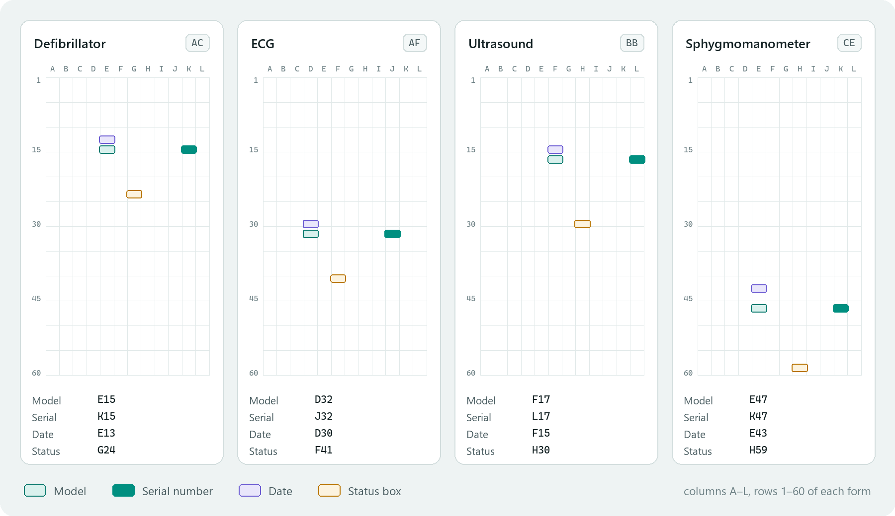
</picture>
</div>

Multiply that by 111 device types. Building the register by hand means opening each file,
working out which form you're looking at, hunting down six cells and copying them across,
hundreds of times, without a single typo in a serial number. It takes an afternoon and it's the
kind of work where mistakes hide.

Calist already knows where every box is. You give it the folder and it gives you the register.

<div align="center">

| By hand | With Calist |
|:---|:---|
| Open 300 files, one by one | Drop the folder on the window |
| Remember 111 layouts | Picked from the file name automatically |
| Find the badly named file at row 214 | Flagged the moment the folder is added |
| Retype serial numbers | Read straight from the cell |
| Sort, number and de-duplicate | Done for you |
| **An afternoon** | **A few seconds** |

</div>

---

## Getting it

<div align="center">

### [Download Calist.exe](https://github.com/AhmedGehad1/Calist/releases/latest/download/Calist.exe)

One file, about 13 MB. No installer, no Python, no setup.

</div>

Double-click it and you're in. The register template is built into the program, so the very
first launch already works.

| | |
|---|---|
| **Runs on** | Windows 10 or 11. No admin rights, no runtime, nothing else to install. |
| **Where it comes from** | Every release is built and tested by [GitHub Actions](https://github.com/AhmedGehad1/Calist/actions/workflows/release.yml) from the tagged source in this repository. Nobody's laptop is involved. |
| **Checking your copy** | Each release ships `SHA256SUMS.txt`. Compare it with `Get-FileHash .\Calist.exe -Algorithm SHA256`. |
| **Older versions** | [All releases](https://github.com/AhmedGehad1/Calist/releases) |

> **The first time you run it**, Windows will say *"Windows protected your PC"*. That's because
> the file isn't code-signed; a signing certificate costs a few hundred dollars a year, and this
> is a free tool. Click **More info**, then **Run anyway**. You only see it once.

### If Windows or your antivirus blocks it

Download **[Calist-windows.zip](https://github.com/AhmedGehad1/Calist/releases/latest/download/Calist-windows.zip)**
instead, unzip it anywhere, and run the `Calist.exe` inside. It's the same program, packaged as a
plain folder, and that packaging is the whole point.

<details>
<summary><b>Why the single file gets flagged, and why the ZIP doesn't</b></summary>

<br>

Some scanners report the single-file download as something like `Trojan:Win32/Sabsik.FL.A!ml`.
The `!ml` at the end matters: it means a machine-learning *guess*, not a match against known
malware. It's a false positive, and a well-known one for Python programs packaged this way.
Three things about the build feed that guess:

| | |
|---|---|
| **It unpacks itself when it starts** | A one-file build extracts its contents into `%TEMP%\_MEIxxxx` and runs from there. Packed malware does exactly the same thing, so this is the heaviest signal. **The ZIP is a folder build and never does it.** |
| **Early builds had no version information** | Before v1.2.0 the file's company, product and version fields were empty. Real software fills them in. **Fixed:** right-click the file, then *Properties*, then *Details*. CI now refuses to publish a build with those fields empty. |
| **It's unsigned** | Only a code-signing certificate fixes this one, and Calist doesn't have one. That's the honest answer. |

What you can do:

- **Use the ZIP.** It removes the biggest of the three signals.
- **Check the hash** against `SHA256SUMS.txt` on the release page.
- **Read the build log.** The whole build is public on the
  [Actions tab](https://github.com/AhmedGehad1/Calist/actions/workflows/release.yml).
- **Report the false positive** to Microsoft through
  [their submission form](https://www.microsoft.com/en-us/wdsi/filesubmission). Corrections
  usually reach every Defender install within a few days.
- **On a managed work machine**, IT can allowlist the file by its SHA-256 hash. Everything above
  is what they'll ask you for.

The build settings that keep this in check are in [`calist.spec`](calist.spec), with comments:
UPX compression is off on purpose (packing an unsigned program is a strong antivirus signal),
and a version resource is generated for every build.

</details>

<details>
<summary><b>Running from source instead</b></summary>

<br>

```bash
git clone https://github.com/AhmedGehad1/Calist.git
cd Calist
pip install -r requirements.txt
python calist.py
```

Python 3.10 or newer. `requirements.txt` pulls in `openpyxl`, `xlrd`, `customtkinter` and
`tkinterdnd2` (the last one is what lets you drop a folder on the window).

</details>

<details>
<summary><b>Building the .exe yourself</b></summary>

<br>

```powershell
pip install pyinstaller
pyinstaller calist.spec --noconfirm --clean              # dist/Calist.exe (one file)
$env:CALIST_ONEDIR=1; pyinstaller calist.spec --noconfirm  # dist/Calist/   (folder)
```

Two things that will save you an hour: PyInstaller won't run at all if the obsolete `pathlib`
backport is installed (`pip uninstall pathlib`), and after upgrading PyInstaller you need
`--clean`, or the exe dies at launch with *"Bootloader did not set sys._pyinstaller_pyz"*.

The version number lives in one place, `__version__` in [`calist.py`](calist.py). The release
workflow refuses to build a tag that disagrees with it.

</details>

---

## The daily access code

The first time Calist opens each day, it asks for a four-digit code. The code changes every day
and is worked out from the date on your machine, so there's no server, no licence file and no
internet connection involved. Once entered, Calist stays unlocked until midnight.

<div align="center">
<picture>
  <source media="(prefers-color-scheme: dark)" srcset="docs/readme/screen-lock-dark.png">
  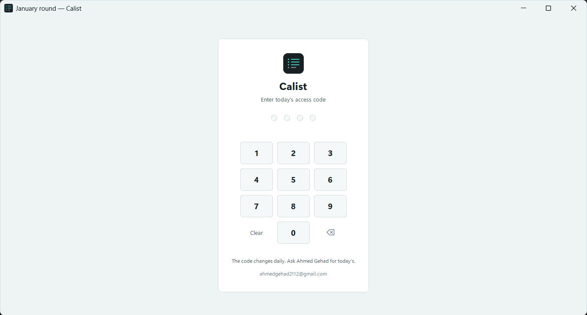
</picture>

**Ask Ahmed Gehad for today's code: [ahmedgehad2112@gmail.com](mailto:ahmedgehad2112@gmail.com)**

</div>

Wrong guesses are rate-limited. After five, a cooldown starts at 30 seconds and doubles each
time, up to 15 minutes. It survives closing the window, and a correct code typed during a
cooldown is still refused. It's there to keep casual use out, and it doesn't pretend to be more
than that.

---

## A round, start to finish

### 1. Drop the folder in

Drag the round's folder onto the window, or press <kbd>Ctrl</kbd>+<kbd>O</kbd>. Every Excel
file inside comes in, subfolders included. Excel's `~$` lock files and Calist's own earlier
output are skipped automatically.

<div align="center">
<picture>
  <source media="(prefers-color-scheme: dark)" srcset="docs/readme/screen-drop-dark.png">
  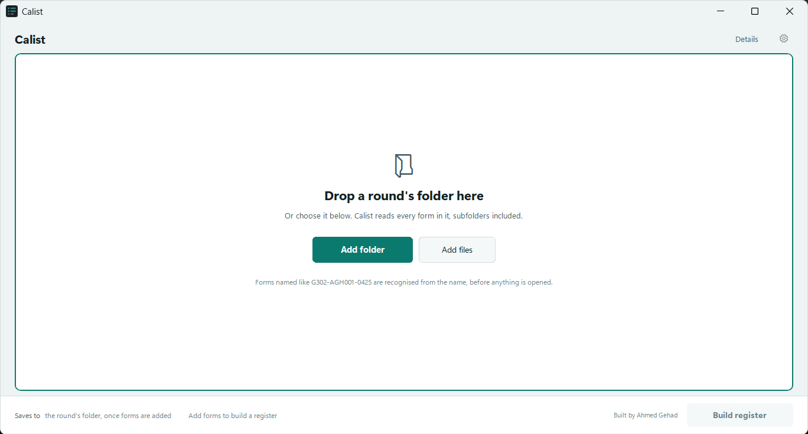
</picture>
</div>

### 2. See the problems before you start

Each file is checked **by its name alone** the moment it arrives, in about 14 microseconds,
without opening it. An unknown device code or a file that isn't a form shows up straight away,
not two hundred files into a run.

Problems are grouped, so fourteen forms with the same bad code are **one chip**, not fourteen rows
to scroll past. Click a chip and the table shows just those files. Right-click a file to open it,
fix it in Excel, then press <kbd>F5</kbd> to check everything again.

<table>
<tr>
<td width="50%">
<picture>
  <source media="(prefers-color-scheme: dark)" srcset="docs/readme/screen-group-dark.png">
  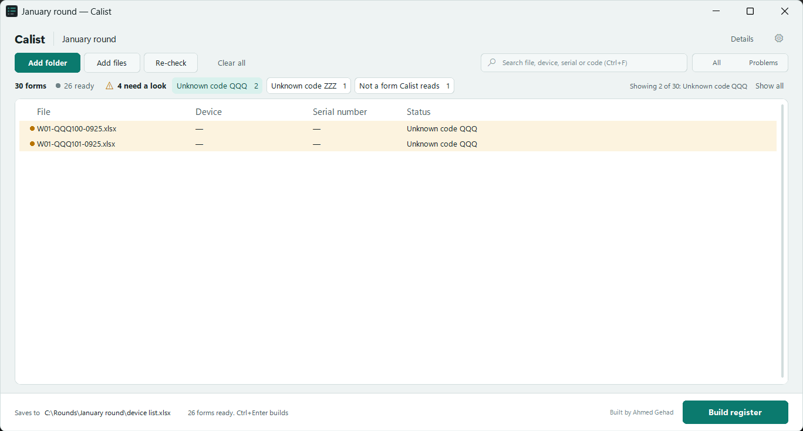
</picture>
<p align="center"><sub>Pick a chip, see only those files.</sub></p>
</td>
<td width="50%">
<picture>
  <source media="(prefers-color-scheme: dark)" srcset="docs/readme/screen-search-dark.png">
  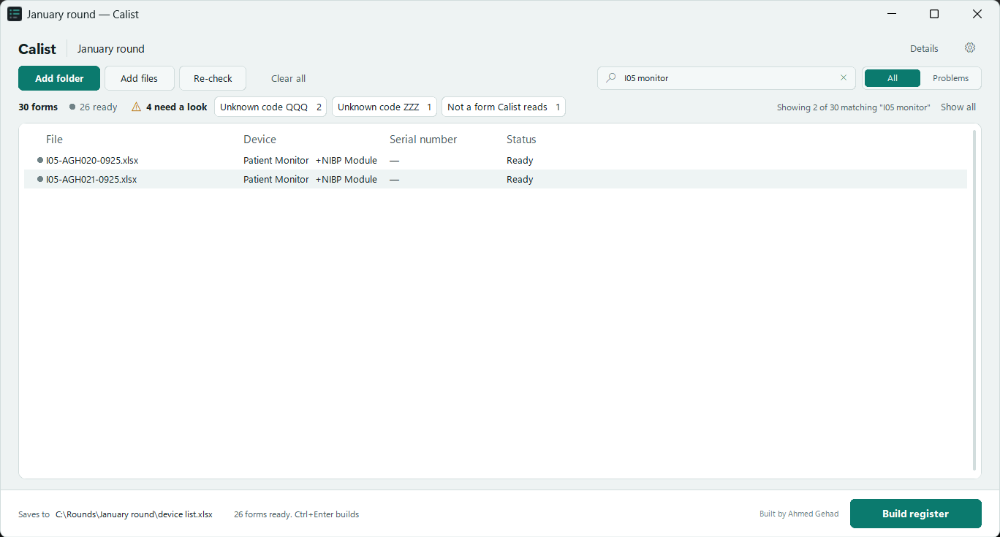
</picture>
<p align="center"><sub><kbd>Ctrl</kbd>+<kbd>F</kbd> searches file, device, serial and code. Words narrow it down.</sub></p>
</td>
</tr>
</table>

### 3. Build, and watch it work

Press **Build register** (or <kbd>Ctrl</kbd>+<kbd>Enter</kbd>). Every row fills in with its serial
number as its form is read. The footer shows the file currently open, the rate, and an honest
estimate of the time left. **Cancel** stops cleanly between two files and writes nothing at all,
so a cancelled run never leaves half a register behind.

<table>
<tr>
<td width="50%">
<picture>
  <source media="(prefers-color-scheme: dark)" srcset="docs/readme/screen-working-dark.png">
  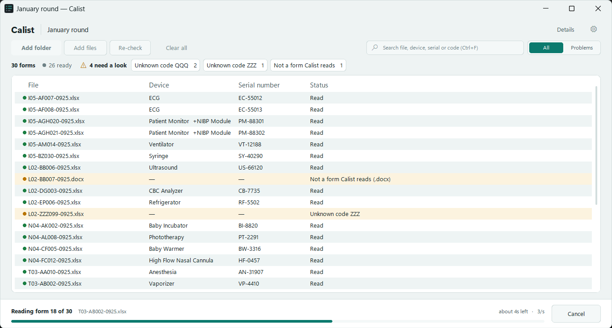
</picture>
<p align="center"><sub>A normal round: every row updates live.</sub></p>
</td>
<td width="50%">
<picture>
  <source media="(prefers-color-scheme: dark)" srcset="docs/readme/screen-turbo-dark.png">
  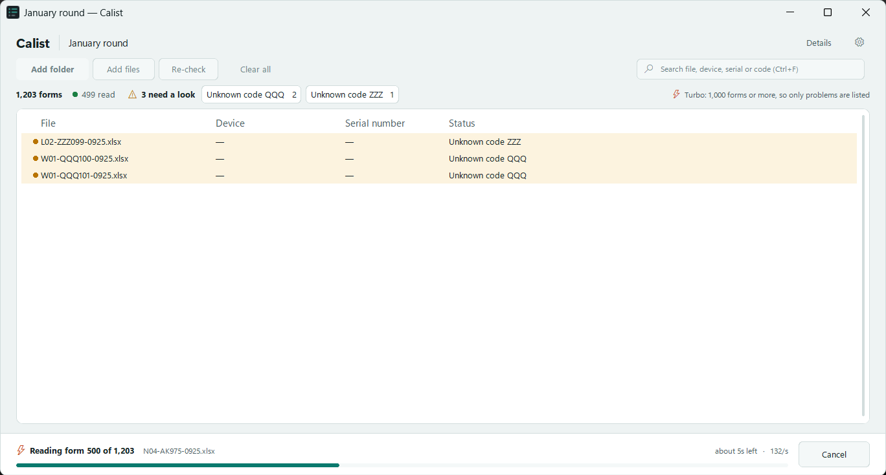
</picture>
<p align="center"><sub>1,000 forms or more: Turbo lists only the problems.</sub></p>
</td>
</tr>
</table>

At a thousand forms or more, Calist switches to **Turbo** on its own. Redrawing forty thousand
rows costs more than reading forty thousand forms, so Turbo lists only the problems and keeps the
window responsive through an archive-sized run.

### 4. Collect the register

The footer tells you what was built and where it went: rows written, module rows added, copies
left out, duplicate serials removed. **Open register** and **Show in folder** are one click away,
and the table narrows itself to whatever still needs a look.

<div align="center">
<picture>
  <source media="(prefers-color-scheme: dark)" srcset="docs/readme/screen-results-dark.png">
  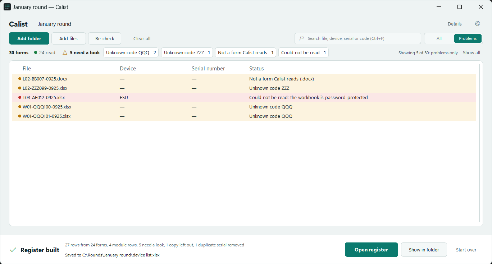
</picture>
</div>

**Details** opens the full log underneath the table: every warning, every skipped copy and every
duplicate, each one naming the files involved.

<div align="center">
<picture>
  <source media="(prefers-color-scheme: dark)" srcset="docs/readme/screen-details-dark.png">
  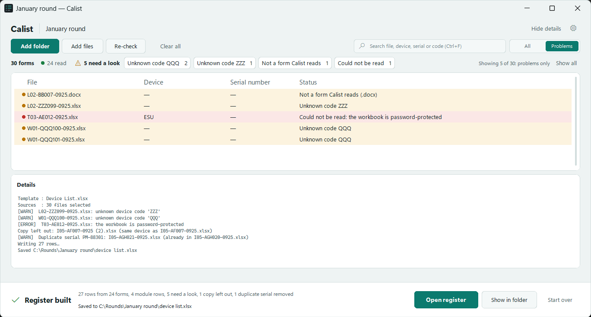
</picture>
</div>

### Where the register goes

`device list.xlsx`, in **the first folder you added**: the round's own folder. The footer shows
the full path before you build, so it's never a surprise. If you need it somewhere else, the gear
opens Settings, where you can pick a folder for this round only. The next round goes back to its
own folder, so January's choice never catches February's register.

<div align="center">
<picture>
  <source media="(prefers-color-scheme: dark)" srcset="docs/readme/screen-settings-dark.png">
  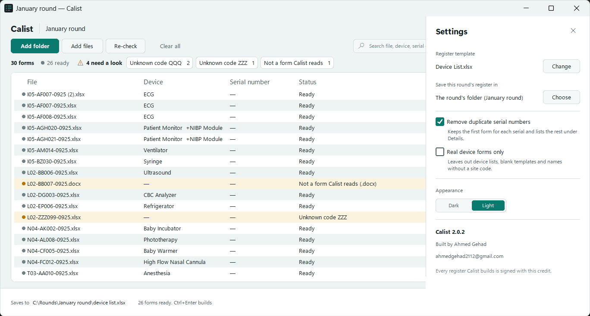
</picture>
</div>

Settings also holds the register template (you can bring your own), the two options described
further down, and dark or light. Everything except the per-round folder is remembered between
sessions in `%APPDATA%\Calist\settings.json`.

### Keyboard

| Keys | What it does |
|---|---|
| <kbd>Ctrl</kbd>+<kbd>O</kbd> | Add a folder |
| <kbd>Ctrl</kbd>+<kbd>F</kbd> | Search the forms |
| <kbd>F5</kbd> | Re-check: read every folder and file again, after you've fixed some |
| <kbd>Ctrl</kbd>+<kbd>Enter</kbd> | Build the register, or open it once it's built |
| <kbd>Ctrl</kbd>+<kbd>,</kbd> | Settings |
| <kbd>Esc</kbd> | Back out one step: the drawer, then a filter or search, then a running build |
| <kbd>Tab</kbd>, <kbd>Enter</kbd>, <kbd>Space</kbd> | Every button is reachable and pressable from the keyboard |
| <kbd>Delete</kbd> | Take the selected files off the list |
| Double-click | Show that file in Explorer |
| Right-click | Open the form, show it in its folder, or copy its name |

The window is built for the laptops engineers carry. It opens at 1000×600, a 1366×768 screen shows
seventeen forms at once, and it looks the same on Windows 10 and Windows 11. Every colour pairing,
in both themes, is tested for WCAG AA contrast, and no status is shown by colour alone: each
problem gets a dot, words and a tinted row.

---

## From form to register

Here is one patient monitor's form, and what Calist writes for it:

<div align="center">
<picture>
  <source media="(prefers-color-scheme: dark)" srcset="docs/readme/form-to-row-dark.png">
  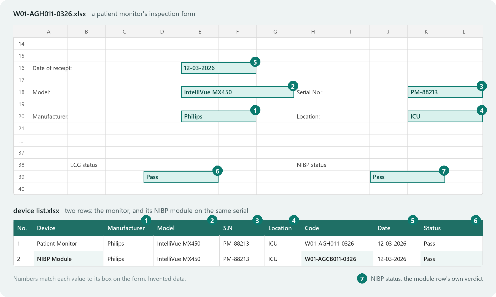
</picture>
</div>

The monitor and its blood-pressure module share one chassis and one serial, but each has its own
verdict box, so the register gets two rows: the monitor, and an `NIBP Module` row right beneath it.

The whole trip, for every file:

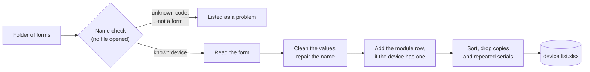
```mermaid
flowchart LR
    A["Folder of forms"] --> B{"Name check<br/>(no file opened)"}
    B -- "unknown code,<br/>not a form" --> P["Listed as a problem"]
    B -- "known device" --> C["Read the form"]
    C --> D["Clean the values,<br/>repair the name"]
    D --> E["Add the module row,<br/>if the device has one"]
    E --> F["Sort, drop copies<br/>and repeated serials"]
    F --> G[("device list.xlsx")]
```

1. **The name picks the device.** `W01-AGH011-0326.xlsx`: everything after the first dash,
   letters only, gives `AGH`, which is a patient monitor.
2. **The device table says where to look.** `AGH` keeps its model in `E18`, its serial in `K18`,
   its ECG verdict in `D39`, and so on.
3. **Only those cells are read.** Calist doesn't load the whole workbook. It goes straight into
   the file for the handful of cells it needs, which is why a form takes about 2 ms.
4. **Values are cleaned and the name is repaired.** A trailing `.0` on a serial is dropped, a typed
   date with a slip in it is fixed, and a file name like `Copy of W01-AGH011-0326` is written as
   the name it was meant to have. The file itself is never renamed.
5. **Module rows, sorting and de-duplication** happen once, across the whole round.
6. **The register is written** into a copy of the template and signed with the author's name,
   both in a footer line and in the workbook's own document properties.

---

## Forms that don't hold still

If every form stayed exactly as its template was drawn, steps 2 and 3 above would be the whole
program. They don't. Forms get re-laid-out between visits, a row gets inserted, a tab gets added,
a box moves two columns to the right. And nothing announces it: a cell map that misses reads
**blank**, and a blank field looks exactly like one an engineer left empty.

So Calist doesn't trust the map blindly. It tries the configured cells first and checks that the
result makes sense: there has to be a serial and a model, the model can't equal the serial, and
the captions printed beside the boxes mustn't say they're something else. If the record fails,
Calist moves down a ladder, and the first believable answer wins:

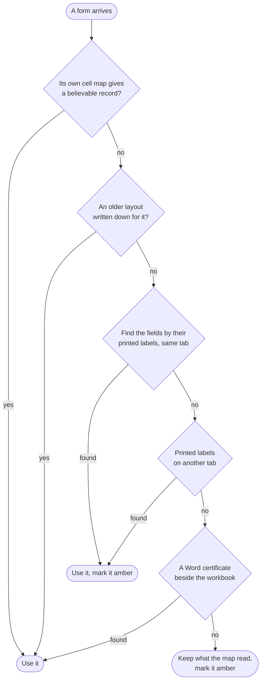
```mermaid
flowchart TD
    S(["A form arrives"]) --> M{"Its own cell map gives<br/>a believable record?"}
    M -- "yes" --> OK(["Use it"])
    M -- "no" --> A{"An older layout<br/>written down for it?"}
    A -- "yes" --> OK
    A -- "no" --> L{"Find the fields by their<br/>printed labels, same tab"}
    L -- "found" --> AM(["Use it, mark it amber"])
    L -- "no" --> T{"Printed labels<br/>on another tab"}
    T -- "found" --> AM
    T -- "no" --> W{"A Word certificate<br/>beside the workbook"}
    W -- "found" --> OK
    W -- "no" --> N(["Keep what the map read,<br/>mark it amber"])
```

Across the whole archive, here's how often each step was needed:

<div align="center">
<picture>
  <source media="(prefers-color-scheme: dark)" srcset="docs/readme/chart-routes-dark.png">
  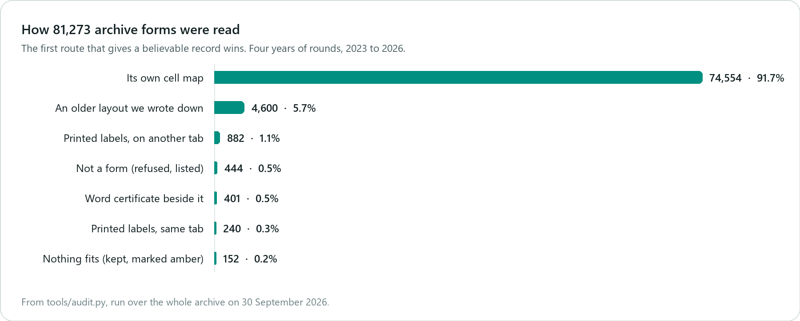
</picture>
</div>

The configured map always wins when it works. The fallbacks can only rescue a file the map got
wrong; they can never change one it already read correctly.

<details>
<summary><b>The specific traps, and the fix for each</b></summary>

<br>

Every one of these was found the hard way: by a field that read wrong or blank, quietly, until
someone noticed.

**The empty first tab.** The X-ray workbook opens on an empty `Waveform Dialog` tab left behind by
its macros; the real form is on the next tab. For a while every X-ray read blank. Calist now
reads the **first tab that holds anything at all**. It doesn't match tab names, because across
the real templates the data tab is called `Device data`, `Device Data`, `Data entry`,
`Inserting data` and `Data device`, and some workbooks have two of them with different layouts.

**Merged boxes.** The forms draw each answer as a box spanning two columns. Excel stores a merged
box's value in its top-left cell only; every other cell in the box reads empty. When the
Ultrasound form was re-laid-out, its map pointed at the second column of the serial box and the
serial disappeared from the register. Calist now follows any merged cell back to its anchor.

**The calibrator is not the device.** These sheets describe two instruments: the device under
test and the meter doing the testing. Both blocks print `Model:` and `Serial No.:`. On a
Hemodialysis cover page the meter comes *first*, so "take the first Model label" recorded the
meter's serial as the machine's, which looks completely plausible. Calist reads the section
headings first and only takes fields from the device's own section.

**The status box wanders.** The verdict box moves sideways more than it moves down, and a map that
places the identity perfectly can still miss the verdict. That record looks fine, so nothing would
ever fall back. Status is therefore settled on its own: kept if it already reads as a verdict,
otherwise found from the form's own `Status:` label. Searching nearby cells instead would have
found the printed legend (`Pass | Fail | Limited non`) sitting on the same row.

**A caption is not a value.** If the box the map points at contains `Safety:` or `Location:`,
that's the form's own printing, not an answer. Calist checks the caption printed beside each box,
and a layout whose captions name a different field is rejected even when its values look
believable. On the Baby Warmer forms alone that corrected 191 records and broke none.

**Certificates.** Some devices keep their identity only in a Word certificate saved next to the
workbook. Mammography is read *only* from its certificate, because every Mammography workbook
carries the same vendor boilerplate header (`GE / Alpha st / Gona Hospital`, 2012) whatever the
site. A cell map would have written that same fake model into every row.

**Lists that look like forms.** A site's device list is named like a form and sits among the
forms. Calist recognises a register by its heading row and refuses to read it as a device.

</details>

---

## The register tells you what it doubts

Calist never drops a value silently. When it keeps something it isn't sure of, the cell is filled
amber and gets an Excel note, signed *Calist:*, saying why. The column layout doesn't change, so
anything that reads the register by position keeps working. (The one thing left out without a
note is the form's own printing: if the Status box holds a caption like `Safety:`, nobody wrote
it, so there's nothing to check.)

<div align="center">
<picture>
  <source media="(prefers-color-scheme: dark)" srcset="docs/readme/notes-dark.png">
  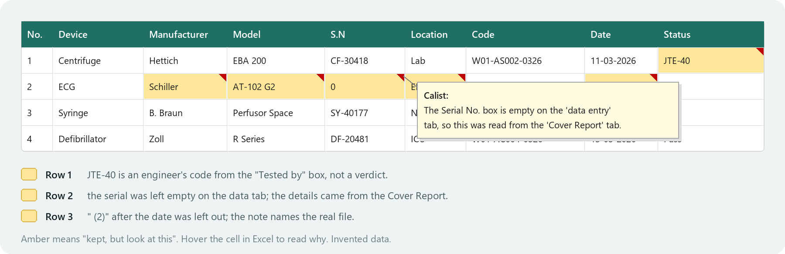
</picture>
</div>

What gets marked, and what the note says:

| The note says | What happened |
|---|---|
| *Read by finding the form's printed labels; this layout is not in the device table yet.* | The form has moved since its map was written, so the values were found by their captions. They're usually right; give them a look. |
| *The Serial No. box is empty on the 'data entry' tab, so this was read from the 'Cover Report' tab.* | The map was right, but an engineer filled in the cover page and not the data tab. The note names whichever box was empty. |
| *No known layout fits this form — this is whatever sits in the mapped cell.* | Nothing on the ladder above produced a believable record. |
| *Not a verdict — an engineer's code, from the 'Tested by' / 'Revised by' box beside the status.* | `JTE-40` in a status box is a person, not a result. |
| *Not a verdict — the status box holds a caption or the answer to a different question.* | `Small`, `N.A`, or a reading like `191.2` where Pass or Fail should be. |
| *Not a recognised verdict.* | Some other text in the status box. |
| *Does not look like a serial number (a date, or no digits).* | Exactly that. |
| *Same as the Model — one of the two is probably misread.* | Manufacturer and Model came back identical. |
| *'(2)' after the date left out. The file is '…'.* | On the Code column: the register uses the repaired name, and the note names the real file so you can find it. |

A status of `0` is **not** marked. On patient-monitor forms the status box copies a test sheet,
and a copy of an empty test is `0`: the module wasn't tested. That's an empty verdict, not a
wrong one.

---

## File names

Calist decides what a file is from its name, before it opens anything:

<div align="center">
<picture>
  <source media="(prefers-color-scheme: dark)" srcset="docs/readme/filename-dark.png">
  
</picture>
</div>

If there's no dash, the whole name is used: `VNT023.xlsx` gives `VNT`. A code that isn't in the
device table is **skipped with a clear message** rather than turned into a junk row. A missing row
is easy to spot and fix; a wrong one might never be noticed.

### Names are repaired, never renamed

People type file names in a hurry. Calist undoes the common slips in the name it *writes* (the
register's Code column), and leaves the files on disk exactly as they are:

| On disk | In the register | Marked amber? |
|---|---|:---:|
| `.W01-AC004-0326` | `W01-AC004-0326` | no |
| `W01-AC004 -0326 ` | `W01-AC004-0326` | no |
| `w01-ac004-0326` | `W01-AC004-0326` | no |
| `W01--AC004-0326` | `W01-AC004-0326` | no |
| `Copy of W01-AC004-0326` | `W01-AC004-0326` | yes |
| `WO1-AC004-0326` (a letter O) | `W01-AC004-0326` | yes |
| `W01-AC004-0326 (2)` | `W01-AC004-0326` | yes |
| `W01-AC004-0326-pending` | `W01-AC004-0326` | yes |
| `W01-AC004-1326` (no month 13) | the month and year from the form's own Date | yes |

Only a repair that changes what the name *says* gets marked. A stray space isn't worth anyone's
time. A name that isn't the house shape at all (`GE TEC850 OR SQAX00871`) is left alone, because
there's nothing to repair it toward. On all 89,538 names in the archive, none of the 78,923 that
were already correct changes.

### Real device forms only

A round folder collects things that aren't device forms: the site's device list, the blank
template the forms were copied from, a file named after its serial. Switch on **Real device forms
only** in Settings and those are kept out of the register and listed under Details, each with its
reason:

- **No site code.** The name has to start with a letter and digits, like `G302-`.
- **A device number of all zeros.** `BZ000` or `AGH00` is the blank template, even if someone typed
  a serial into it.
- **A device list, or a form with nothing filled in.** Those need the workbook to tell, so they
  drop out during the run.

### Copies

When a repaired name lands on a file already in the round (`W01-AF007-0326 (2)` next to
`W01-AF007-0326`), only the original is kept, **if it's the same device**. A copy with the same
serial, or with none, is left out and listed. A copy with a *different* serial is a different
device filed under a copy's name, so it stays, marked. And when there's no plain original at all,
the extra text is what tells the files apart (`-SEVO` and `-ISO` are two vaporizers), so nothing
is cut.

---

## Two-row devices and duplicate serials

A few devices are inspected as one unit and recorded as two. The patient monitor and its NIBP
module are the main case, as in the picture above. The vital-signs monitor works the same way,
with an SpO2 row and an NIBP row. The generated row copies its parent, takes the second verdict
box, rewrites the device part of the code (`W01-AGH011-0326` becomes `W01-AGCB011-0326`) and
always sorts directly beneath its parent.

With **Remove duplicate serial numbers** switched on, a serial seen twice keeps the first form
and drops the second, and the log names **both files**:

```
Duplicate serial 'PM-88301' — skipped I05-AGH021-0925.xlsx, already recorded by I05-AGH020-0925.xlsx
```

Files, not device types, because a round with a dozen identical monitors makes the type useless
for finding the form to open. A device and its own module row may share a serial (they're one
machine); a *third* record on that serial is still dropped. Blank serials are always kept, so
several devices with no serial recorded never collapse into one row.

---

## The device table

All 111 device types live in [`device_config.py`](device_config.py). Most forms are the same
layout at a different height, so a device is usually a single line:

```python
"DG": {"device_name": "CBC Analyzer", "cells": form(18, "K22")},
```

`form()` takes the row that holds the **Model** and works everything else out from it:

```
               form(18, "K22")

  Date           E16    row - 2
  Model          E18    row            <- the anchor
  Manufacturer   E20    row + 2
  S.N            K18    same row, value column
  Location       K20    row + 2, value column
  Status         K22    given outright; it's the one that moves most
```

| Argument | Use it when | Example |
|---|---|---|
| `col=` / `val=` | the form uses another pair of columns | `form(32, "F41", col="D", val="J")` |
| `date_gap=4` | there's an extra line above the date | `form(18, "G26", date_gap=4)` |
| `extra={...}` | a second serial, a second status, or one odd cell | `form(17, "H30", extra={"S.N2": "L21"})` |

The genuinely different forms (the Baby Incubator, the Baby Warmer and a few others) are written
out in full. That's on purpose: the odd ones should stand out, not hide in a wall of near-identical
lines. Beyond the cells, a device can carry older layouts (`alt_cells`), per-field candidate cells
picked by their captions (`field_alternates`), a second row (`second_row`), or a Word certificate
as its only source.

**Adding a device** is one line: find the Model cell on its form, note the Status box, and add
`"XY": {"device_name": "Your Device", "cells": form(<model row>, "<status cell>")}`. Sorting,
module rows and de-duplication follow on their own. Check it against a real form first:

```powershell
python calist.py --inspect "W01-XY001-0326.xlsx"
```

That prints every mapped field, the cell it reads, what came back, the sheet and its merged
ranges, and exits non-zero if anything read blank.

<details>
<summary><b>All 111 device types</b></summary>

<br>

| | | |
|---|---|---|
| `AA` Anesthesia | `BZ` Syringe | `FF` EEG |
| `AB` Vaporizer | `CA` Dental X-Ray | `FG` ACT |
| `AC` Defibrillator | `CB` Digital Blood Pressure | `FI` Hormone Analyzer |
| `AD` Pacemaker | `CD` Endoscopic Set | `FJ` OR Table |
| `AE` ESU | `CE` Sphygmomanometer | `FM` PCR Rotor |
| `AF` ECG | `CF` Baby Warmer | `FP` Dexa Scan |
| `AG` Patient Monitor | `CK` Infrared Lamp | `FQ` C-pap |
| `AGH` Patient Monitor | `CN` Microwave | `FR` Sodium & Potassium Analyzer |
| `AH` Pulse Oximeter | `CP` Vertebral Column Stretcher | `FT` Biofeedback |
| `AI` Infusion | `CZ` Mixture Device | `FU` Joint Mobiliser |
| `AJ` Suction | `DA` Shaker | `FV` Cardiac Enzyme Analyzer |
| `AK` Baby Incubator | `DB` Hot Plate | `FW` Blood Culture System |
| `AL` Phototherapy | `DE` Colony Counter | `FZ` Endoscope |
| `AM` Ventilator | `DG` CBC Analyzer | `GC` Portable Data Logger |
| `AN` Infrared Thermometer ¹ | `DL` Sealing Machine | `GD` Protein Analyzer |
| `AO` Patient Thermometer | `DO` O2 conc | `GE` Temperature Calibration Tester |
| `AQ` Water Bath | `DS` Spirometer | `GH` Bipap |
| `AR` Electrolyte Analyzer | `DU` Immunoassay Analyzer | `GI` Bacteria Analyzer |
| `AS` Centrifuge | `DV` OR Light | `GJAF` Aortic Balloon |
| `AU` Chemistry Analyzer | `DW` Heater Air Mattress | `GK` Tourniquet |
| `AV` Elisa Reader | `DX` Fetal Doppler | `GM` Corona Virus Analyzer |
| `AX` Lab Incubator | `EA` C-Arm | `GN` Panorama X-ray |
| `AY` Virus & PCR Analyzer | `EC` Laminar Flow | `GO` ICU Bed |
| `BB` Ultrasound | `ED` Heart Lung Machine | `GP` Holter Machine |
| `BC` Ultrasound (Eye) | `EE` Flowmeter | `GR` Laser Therapy |
| `BD` Mammography ² | `EN` Catheter Lab | `GT` Spinal Traction |
| `BE` X-ray (Mobile) | `EO` Pipet | `GU` Shockwave Therapy |
| `BF` X-ray | `EP` Refrigerator | `GV` Electrotherapy Machine |
| `BJ` Auto Refractometer | `EQ` Urine Analyzer | `GX` PRF Generator |
| `BL` Autoclave | `EU` Lab Oven | `GY` Infrared Sterilizer |
| `BM` Hemodialysis Machine | `EV` Blood Mixer | `HA` HPLC Analyzer |
| `BN` Therapeutic Ultrasound | `EY` Freezer | `HB` Sentifit System |
| `BP` Balance | `EZ` Non-invasive Hemodynamic Monitor | `HC` Therapeutic Apheresis Machine |
| `BQ` Flatbed Platelet Agitator | `FA` Elisa Washer | `HD` Microtome |
| `BV` Blood Gas Analyzer | `FC` High Flow Nasal Cannula | `J` OR Table (Electrical Safety) |
| `BW` CT | `FD` Drugs Analyzer | `VAGH` Patient Monitor |
| `BX` MRI | `FE` Nebulizer | `VAH` Vital Sign (SPO2 Module) |

¹ Named per form from the data tab's own **Device Type** box: `Digital Thermometer`, or
`Portable Data Logger` when the certificate says so. A form that only says "Thermometer", or has
no box, is an `Infrared Thermometer`.
² Read only from the Word certificate saved beside the workbook. See
[the traps](#forms-that-dont-hold-still).

</details>

---

## Speed

Reading a form used to mean `openpyxl.load_workbook`, which parses every worksheet, every style
and every drawing in the file in order to reach seven cells. That cost about **380 ms a form**, and
a 300-form round spent two and a half minutes on it.

Calist now has its own reader for `.xlsx`. It opens the file, reads the one worksheet it needs, and
picks out only the requested cells, loading the shared strings and styles only when one of those
cells needs them. That's about **2 ms a form**. Before it replaced the old reader, it was checked
cell by cell against it: 82 real workbooks, 171,200 cells, **zero differences**. Legacy `.xls`
files go through `xlrd`, one sheet at a time.

<div align="center">
<picture>
  <source media="(prefers-color-scheme: dark)" srcset="docs/readme/chart-time-dark.png">
  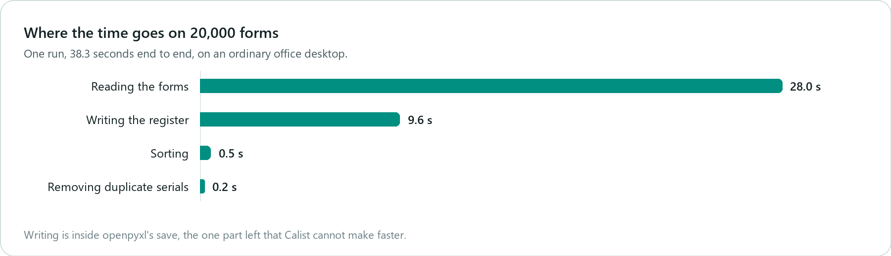
</picture>
</div>

| | |
|:---|:---|
| One form | **about 2 ms** (it was about 380 ms) |
| A 300-form round | **a couple of seconds** |
| 20,000 forms into one register | **about 38 seconds** |
| Scanning a folder of 20,000 forms | **under a second**, and the window stays live |
| Checking a new file's name | **about 14 µs**, with nothing opened |
| Starting the packaged app | **3 to 4 seconds** |

There is deliberately **no thread pool**. It was measured twice: after decompression the work is
pure Python and holds the GIL, and at 2 ms a form the pool's overhead costs more than the
parsing. Eight threads were slower than one.

---

## How a change gets proven

This tool writes records that get signed and filed, so "the tests pass" isn't enough. Every change
that touches what Calist reads is checked against the **real archive**, by reading every form
with the old code and the new code and comparing the results.

`tools/audit.py` does that at scale. It reads all four years of forms the way the register does,
then asks each form independently what the answer *should* be: the certificate tab (whose
formulas name the exact cell they copy), the printed labels, the shape of each value, and the same
serial across years. On the latest run, over 81,273 forms:

| | Fields |
|---|---:|
| Agree with the form's own evidence | **477,400** |
| Empty on the form itself | 23,390 |
| Wrong or in the wrong place | 240 |

Its `--diff` mode is the gate: it re-judges a before and an after snapshot with today's rules, and
a regression is any field that was right and isn't now. The bar for a change to the reader is
**zero regressions** across the archive. Two rules came straight out of it:

- **Prove a cell change by value, on every form, `.xls` included.** Formula evidence once called a
  Baby Warmer map change safe that would have broken every 2025–26 form, because those are `.xls`
  files, whose formulas can't be read.
- **A swap that fixes many forms and breaks a few is not a fix.** When one cell can't serve every
  form, `field_alternates` lets each form pick its own by caption.

The audit only ever reads the forms. It writes to its own `_Calist audit` folder and refuses any
destination inside a customer folder, because a shadowed loop variable once saved a report over a
customer's workbook.

---

## Scripting it

The pipeline doesn't import a GUI toolkit, so everything runs from plain Python:

```python
from calist import process_files

result = process_files(
    ["W01-AGH011-0326.xlsx", "W01-AC004-0326.xlsx"],
    "Device List.xlsx",
    deduplicate=True,
    real_forms_only=True,
)

print(result.rows_written, "rows ->", result.output_path)
for problem in result.problems:
    print(f"skipped {problem.filename}: {problem.detail}")
```

`process_files` also takes `on_file=` for per-file progress, `cancel=` (a `threading.Event`) to
stop a long run, which writes nothing, and `output_dir=`. The result carries every file's outcome,
the duplicates removed with both file names, the copies left out and the module rows added.

To ask what a file *would* be without opening it:

```python
from calist import classify_file

classify_file("W01-AGH011-0326.xlsx").device_name   # 'Patient Monitor  +NIBP Module'
classify_file("W01-ZZZ999-0326.xlsx").status        # 'unknown_code'
classify_file("W01-BZ000-0326.xlsx", real_forms_only=True).detail
# 'device number BZ000 — a template, not a device'
```

---

## Development

```powershell
pip install -r requirements.txt
pip install pytest
python -m pytest                       # 469 tests, no display needed
python -m pytest -k merged             # one topic
python -m pyflakes ui.py               # the quick lint
python tools/snap_ui.py --theme dark   # every screen, rendered to docs/review/
python docs/make_readme_art.py         # the pictures in this README
```

CI runs the suite on Windows with Python 3.10, 3.11 and 3.12 on every push. Releases are built by
CI too: bump `__version__`, push a `vX.Y.Z` tag, and the workflow tests, builds both download
shapes, checks the version resource and file size, writes the checksums and publishes.

| Suite | Tests | What it holds down |
|---|---:|---|
| [`test_calist.py`](test_calist.py) | 259 | The pipeline: the reader, layouts and fallbacks, status settling, name repair, copies, sorting, de-duplication, notes, end-to-end runs on workbooks built in the test |
| [`test_firebase_export.py`](test_firebase_export.py) | 127 | The archive export: stable record ids, repaired names, what gets left out and what gets deleted |
| [`test_access.py`](test_access.py) | 35 | The daily code: known dates, midnight, rate limiting that survives a restart |
| [`test_settings.py`](test_settings.py) | 21 | Settings that read and write safely, even when the file is corrupt or the profile is read-only |
| [`test_ui_state.py`](test_ui_state.py) | 14 | What the window shows: problem groups, search, the save-folder rule, the Turbo threshold |
| [`test_theme.py`](test_theme.py) | 12 | Every colour pair against WCAG AA in both themes, font fallbacks, every icon checked against the font |
| [`test_device_config.py`](test_device_config.py) | 1 | The five cell maps the companion phone app writes with its own copy of `form()` |

A few tests exist only to stop a future change from quietly weakening something: renaming a device
can't break the shared-serial exemption, the name check can't start touching the disk (it's tested
on a path that doesn't exist), and a missing settings file reads as **locked**, never unlocked.

### How it's put together

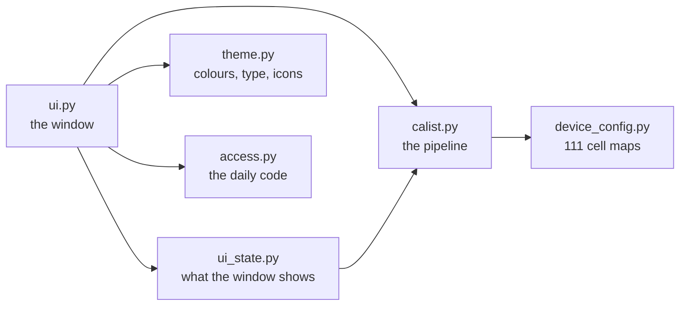
```mermaid
flowchart LR
    ui["ui.py<br/>the window"] --> calist["calist.py<br/>the pipeline"]
    ui --> state["ui_state.py<br/>what the window shows"]
    ui --> theme["theme.py<br/>colours, type, icons"]
    ui --> access["access.py<br/>the daily code"]
    state --> calist
    calist --> config["device_config.py<br/>111 cell maps"]
```

Imports only go one way. `calist.py` never imports a GUI toolkit (the window is imported lazily
inside `main()`), which is what lets the whole suite run without a display. `access.py` imports
nothing from the rest of the app, so a pipeline change can't break the lock.

The two places the halves meet are **logging**, which feeds the Details drawer, and the
**`FileOutcome` / `RunResult`** structures, which feed the table. Work runs on a worker thread
that never touches a widget and never reads a Tk variable; everything comes back through a queue
that the main thread drains in batches, so three hundred files don't redraw the table three
hundred times.

```
calist.py            the pipeline: reader, layouts, names, register writer   3,534 lines
ui.py                the window (CustomTkinter)                              2,793 lines
firebase_export.py   publishes the archive to the inspection app             3,383 lines
device_config.py     111 cell maps and the form() helper                       587 lines
theme.py             the palette, fonts and icons, as plain data               228 lines
ui_state.py          what the window shows, as plain logic                     174 lines
access.py            the daily access code                                     138 lines
tools/audit.py       the archive audit                                         946 lines
tools/snap_ui.py     renders every screen for design review                    429 lines
calist.spec          the PyInstaller recipe
template/            the register template that ships inside the exe
```

### Windows 10 is a first-class citizen

The development machine runs Windows 11; many of the machines Calist runs on don't. A Windows
11-only font or window attribute looks perfect here and fails *silently* there, and the test suite
can't see a window. So: `Segoe UI Variable` falls back to `Segoe UI`, `Cascadia Mono` to `Consolas`,
icons come only from `Segoe MDL2 Assets` (which both versions ship), and the Windows 11 title-bar
touches are optional extras that never raise. `snap_ui.py --win10` renders every screen the way
Windows 10 draws it.

---

## Known limits

Said plainly, so nobody has to find out the hard way:

- **A blank field almost always means the form was re-laid-out.** The fallbacks catch most of
  these, and `--inspect` shows you the rest in seconds.
- **152 forms in the archive match no layout at all.** They're still written, as whatever their
  map read, and marked amber so a person checks them.
- **A serial that an `.xls` file stored as a number has already lost its leading zero.** Nothing
  can bring that back. The register's serial column is text, so a serial typed in later keeps it.
- **A formula cell in a workbook that was never opened in Excel reads blank.** Excel saves a
  formula's last result; a file written by a script has none to read.
- **The access code is a speed bump, not a lock.** The formula is in this public repository and
  the system clock is the only authority on the date. It keeps casual use out; it isn't
  licensing.
- **Device names are written exactly as the table spells them.** Changing one changes every
  register built afterwards, so it's treated as a data decision, made by the owner, never a
  drive-by fix.

---

## Author

<div align="center">

### Ahmed Gehad

[](mailto:ahmedgehad2112@gmail.com)

</div>

Every register Calist builds is signed: a footer line under the data, and the author fields in the
workbook's document properties. The credit travels with the file wherever it's emailed or filed.

## License

No licence is granted. The source is published so it can be read; all rights are reserved by the
author. If you'd like to use it, get in touch.
